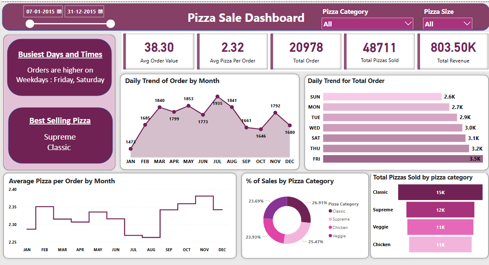

# Pizza Sales Analysis

## Project Overview
This pizza sales analysis project aims to provide insights into the sales performance over the past year. By analyzing various aspects of the sales data, we seek to identify trends, make data-driven recommendations, and gain a deeper understanding.

## Dataset 
The primary dataset used for this analysis is the "pizza_sales.csv" file, containing detailed information 

## Tools
- Excel - Data Cleaning
- SQL Server - Data Analysis <a href= "https://github.com/SiddhiT01/Pizza_sales_project/blob/main/pizza%20sales%20project.docx"> SQL File</a>
- PowerBI - Creating reports <a href= "https://github.com/SiddhiT01/Pizza_sales_project/blob/main/pizza%20sales%20project.pbix"> PowerBI File</a>

## Key Insights
- Total Orders: 20,786
- Total Pizzas Sold: 48,273
- Total Revenue: $796,330
- Average Order Value: $38.31
- Best Selling Pizza: Supreme Classic
- Busiest Days: Friday and Saturday
- Peak Order Month: July

## Dashboard Preview

## Conclusion
The Pizza Sales Dashboard provides clear insights into business performance across time, categories, and customer preferences. By analyzing this data:
The company can focus on high-performing items like Supreme Classic pizza.
Adjust marketing/promotions around Fridays and Saturdays, the peak days.
Optimize inventory and staffing based on monthly and weekly sales patterns.
This project demonstrates practical skills in data transformation (SQL), visualization (Power BI), and storytelling through dashboards.
