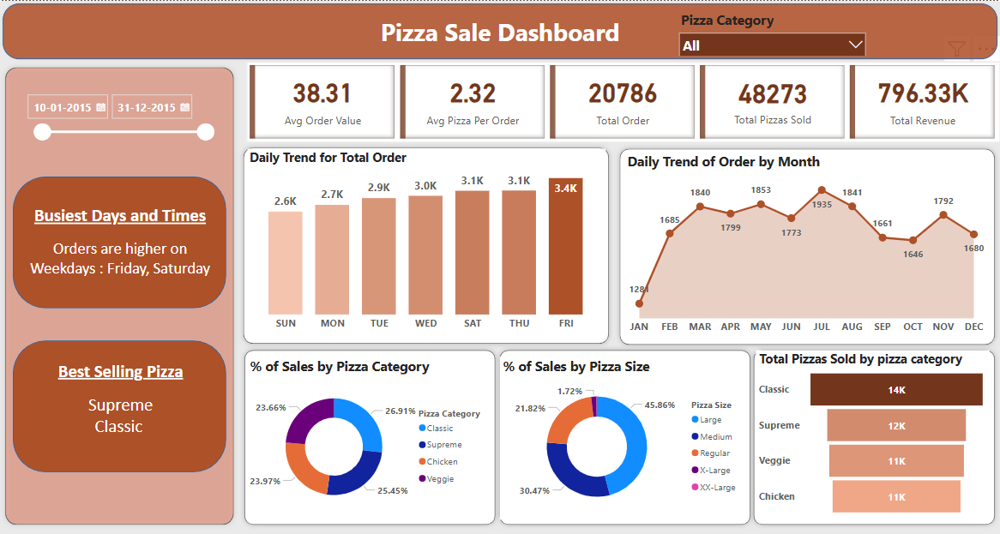

# Pizza Sales Analysis

## Project Overview
This pizza sales analysis project aims to provide insights into the sales performance over the past year. By analyzing various aspects of the sales data, we seek to identify trends, make data-driven recommendations, and gain a deeper understanding.

## Dataset 
The primary dataset used for this analysis is the "pizza_sales.csv" file, containing detailed information 

## Tools
- Excel - Data Cleaning
- SQL Server - Data Analysis
- PowerBI - Creating reports

## Key Insights
- Total Orders: 20,786
- Total Pizzas Sold: 48,273
- Total Revenue: $796,330
- Average Order Value: $38.31
- Best Selling Pizza: Supreme Classic
- Busiest Days: Friday and Saturday
- Peak Order Month: July

## Dashboard Preview

## Conclusion
